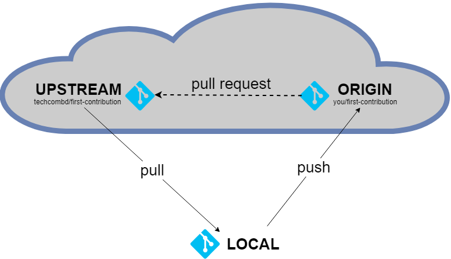
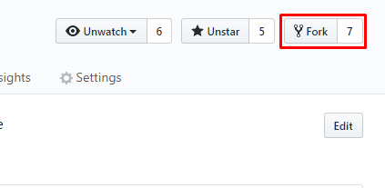
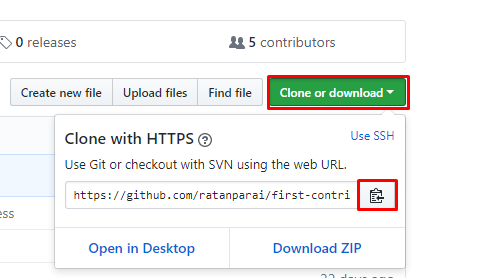

# How to contribute

Before going deep into the steps of how to contribute please remember you **DO NOT NEED** to follow the remote names we used. You can use anything you want. You need to change your command depending on the name you choose. In this tutorial we use-

- **upstream** - Remote name of `techcomdbd`'s repository.
- **origin** - Remote name of your forked repository.

## Steps for doing a pull request

Here is a high level diagram of relations between remote and local repositories-



1. Fork the repository



2. Get the link of your forked git repository repository for clone-



Clone the forked repository to your computer using the following command-

```
git clone [your_forked_repository_url/ssh_link]
```

Example:

```
git clone git@github.com:ratanparai/first-contributions.git
```

3. Now `cd` into the cloned folder-

```
cd first-contributions
```

4. add upstream remote-

```
git remote add upstream [upstream_url]
```

Example: for our first-contributions repository-

```
git remote add upstream https://github.com/techcombd/first-contributions.git
```

Check if the upstream remote was added successfully-

```
git remote -v
```

You should see something like this-

```
origin  git@github.com:ratanparai/first-contributions.git (fetch)
origin  git@github.com:ratanparai/first-contributions.git (push)
upstream        https://github.com/techcombd/first-contributions.git (fetch)
upstream        https://github.com/techcombd/first-contributions.git (push)
```

5. fetch upstream branch-

```
git fetch upstream
```

**Note:** This command fetch the upstream branch into your local disk. You can see those by running-

```
git branch -a
```

6. set upstream for master branch

```
git branch -u upstream/master
```

Now when you run-

```
git status
```

you should see something like-

```
On branch master
Your branch is behind 'upstream/master' by 14 commits, and can be fast-forwarded.
  (use "git pull" to update your local branch)

nothing to commit, working tree clean
```

Pull changes from upstream (if there is any) -

```
git pull
```

Now push change to your forked repository(origin)-

```
git push origin master
```

To know more read [Git Branching - Remote Branches](https://git-scm.com/book/en/v2/Git-Branching-Remote-Branches)

7. create new branch. follow standard **(Not Mandatory)**

```
git checkout -b feature/add-ratanparai
```

8. Push the branch to your origin(forked) repository while linking the branch with origin's remote branch

```
git push -u origin feature/add-ratanparai
```

9. made changes to files (do what you want to do for the work)
10. `add` and `commit` changes

```
git add .
git commit -m "write your commit message here"
```

11. push changes

```
git push
```

12. Go to your forked repository or upstream repository URL, example [techcombd/firsts-contribution](https://github.com/ratanparai/first-contributions) you should see something like-


Click **Compare & pull request** to start the `pull request` process. In the next page give your pull request a easy to understand title and clear description what you are trying add to the project.


## Your next contribution
Good job. You have successfully contributed for the first time to a Open Source Project Repository. Now you want to contribute more to the same project you have `forked`, `cloned` and `contributed`! Just follow those steps-


1. Checkout to `master` branch -

```bash
git checkout master
```

2. Pull changes from `upstream` remote-

```bash
git pull upstream
```

3. Push changes to `origin` remote-

```bash
git push origin
```

4. Create new branch. Follow from **Step 7** of [Steps for doing a pull request](#steps-for-doing-a-pull-request)

## How to keep Up-to-Date with the upstream repository

It is a good practice to pull any changes from upstream and merge them to your working branch everyday before you start working. To do this at first checkout to master branch-

```
git checkout master
```

Pull changes from upstream-

```
git pull upstream
```

Push changes to your origin master-

```
git push origin
```

checkout to your working branch-

```
git checkout [your_working_branch_name]
```

rebase changes from the master branch-

```
git rebase master
```

If there is no conflict then you are good continue your work. But if there is `merge conflict` error, don't be alarmed. you can easily resolve the merge conflict manually with your editor of choice or using `mergetool`. There is a good resource about resolving merge conflict [here](https://gist.github.com/karenyyng/f19ff75c60f18b4b8149)


## Finishing touch

- Be **Patience**. Read the documentation carefully and wait for Maintainer's response of your pull request. Don't think your pull request will be get merged quickly or merged at all. Respect the decision of others.

- If you need to update `content` of the pull request **you do not** need to create another pull request. Just push changes to the branch of your personal(origin) repository. The changes will show up in your pull request.

- **ALWAYS READ AND FOLLOW THE DOCUMENTATION OF THE REPOSITORY YOU ARE CONTRIBUTING**. They may have special requirement or rules. Follow them.

- if maintainer merge the changes then you can safely delete the branch. To work in new content, create a new branch and work on that branch. You should always create different branch for each pull request.
